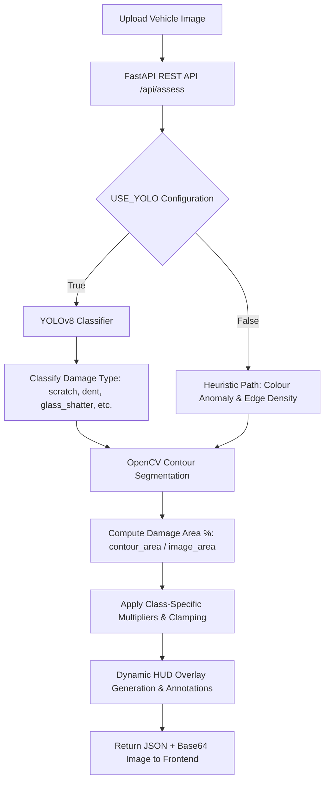

# 🚗 AutoShield: AI-Driven Vehicle Insurance Claim Management

AutoShield is a state-of-the-art, full-stack vehicle insurance claim management system. By combining Deep Learning (Computer Vision via YOLOv8) with traditional Computer Vision (OpenCV contours) and a high-performance **React (Vite) + FastAPI** architecture, AutoShield automates physical damage assessment, verifies claim legitimacy, estimates payouts, and manages fraud exposure.

The user interface strictly implements a **photography-first Apple design aesthetic**—alternating light and dark full-bleed canvas sections, negative letter-spaced headlines, a single brand accent color (**Action Blue `#0066cc`**), and a museum-gallery presentation layout.

---

## 🌟 Key Features

* **Apple Museum Gallery Aesthetic**: Clean, zero-chrome layouts governed by a single brand interactive color (`#0066cc`), frosted-glass sticky sub-navigation, and strict grid container configurations.
* **Hybrid AI-CV Damage Analysis**: Integrates a custom YOLOv8 classifier with adaptive OpenCV contour geometry to calculate the precise surface area percentage and severity of vehicle damage.
* **Smart Payout Estimation**: Employs insurance actuarial mapping logic to calculate vehicle payouts automatically while subtracting standard deductibles:
  $$\text{Payout} = \max\left(0, (\text{Damage \%} \times \text{Vehicle Price}) - \text{Deductible}\right)$$
* **Automated Fraud Screening**: Identifies mismatch patterns where claimants report severe damage but visual AI evidence shows only minor wear.
* **Operational Intelligence Dashboard**: Pinned metrics displaying claims counts, active fraud rates, net payout exposure, and dynamic SVG density charts.

---

## 🛠️ Full-Stack Technology Stack

To achieve a scalable, enterprise-ready deployment, AutoShield is designed around the following architectural stack:

| Layer | Technology | Purpose |
| :--- | :--- | :--- |
| **Frontend Client** | React 18 (Vite SPA) + index.css | Apple-design museum gallery, real-time uploader, filter options, and interactive SVGs |
| **Backend REST API** | FastAPI / Python 3.13 | High-performance JSON API routing, CORS integration, and ML inference serving |
| **Deep Learning Engine** | YOLOv8 (Ultralytics) + PyTorch | Visual damage classification (dent, scratch, glass shatter, crack, lamp broken, flat tire) |
| **Image Analysis Engine** | OpenCV (cv2) + NumPy | Geometric contour mapping, edge density calculation, and dynamic HUD overlay generation |
| **Database & Analytics** | PostgreSQL / Snowflake / SQLite | Tabular claim history, policy details, and analytical log storage |

---

## 📐 Hybrid Damage Assessment Pipeline

AutoShield utilizes a two-stage hybrid approach to visual damage assessment to address common pitfalls in confidence-based estimation:



### Damage Severity Matrix & Physics-Based Multipliers

Damage calculations are calibrated using standard insurance industry guidelines. Each detected category has unique characteristics:

| Damage Class | Severity Weight | Minimum Area Floor | Maximum Area Ceiling |
| :--- | :---: | :---: | :---: |
| **Scratch** | `0.6` | 2.0% | 12.0% |
| **Lamp Broken** | `0.8` | 5.0% | 18.0% |
| **Crack** | `0.9` | 8.0% | 22.0% |
| **Tire Flat** | `1.0` | 10.0% | 28.0% |
| **Dent** | `1.3` | 15.0% | 55.0% |
| **Glass Shatter** | `1.6` | 30.0% | 80.0% |

> [!NOTE]
> The final damage percentage is computed as:
> $$\text{Damage \%} = \text{Clamp}\left( \text{Raw Area \%} \times \text{Class Weight}, \text{Min \%}, \text{Max \%} \right)$$
> This prevents confidence scores (how sure the model is of the class) from inflating physical damage metrics, resulting in highly reliable payouts.

---

## 📂 Project Directory Structure

Here is the comprehensive file layout of the AutoShield project:

```text
Car_Claims-main/
│
├── data/                          # Datasets and assets
│   ├── yolo_dataset/              # Split folders generated by training pipeline
│   ├── carclaims.csv              # Raw historical vehicle claim records
│   ├── processed_claims.csv       # Unified CSV (tabular + CV attributes) used by Dashboard
│   └── synthetic_insurance_applicants.csv   # Synthesized demographic data
│
├── docs/                          # Guides and Documentation
│   └── ROADMAP.md                 # Complete SaaS implementation & deployment roadmap
│
├── frontend/                      # Premium React Frontend Client
│   ├── src/
│   │   ├── App.jsx                # Main museum-gallery portal and file uploader
│   │   ├── index.css              # Apple Design Token stylesheet (Inter / Action Blue)
│   │   └── main.jsx               # Entrypoint bootstrapping React
│   ├── package.json               # Node packages (including lucide-react, recharts)
│   └── vite.config.js             # Pinned server configuration and proxy rules
│
├── role2/                         # Computer Vision Module (Damage Assessment)
│   ├── train_model.py             # Downloads Kaggle dataset, organizes data, trains YOLOv8
│   ├── damage_detector.py         # Primary CV assessment script (YOLOv8 + OpenCV contours)
│   ├── best.pt                    # Custom trained YOLOv8 classification model weights
│   └── yolov8n-cls.pt             # Pre-trained base YOLOv8 classification weights
│
├── role6/                         # Business Intelligence & Analytics Module
│   └── analytics_queries.sql      # Snowflake/PostgreSQL compatible data warehouse queries
│
├── main.py                        # FastAPI REST API Backend
├── requirements.txt               # Unified project python dependencies
└── dataset_mapper.py              # Bridges raw claims with CV percentages to output processed_claims.csv
```

---

## 🚀 Active Development & Quick Start

The local environment is fully configured and verified to run successfully on Windows.

### Development Roadmap

For the complete 8-week production SaaS deployment checklist, refer to:
👉 **[SaaS Implementation Roadmap](file:///d:/Car_Claims-main/Car_Claims-main/docs/ROADMAP.md)**

### Running the Services

#### 1. Backend REST API
The FastAPI backend is active and listening on `http://localhost:8000`.

To start manually:
```powershell
# Activate virtual environment and run main.py
.\venv\Scripts\python.exe main.py
```

Available API Endpoints:
- `GET /api/claims` - List claims with active filters (year, make, base policy, fraud status).
- `GET /api/filters` - Fetch unique filter options populated dynamically from dataset.
- `GET /api/metrics` - Fetch real-time KPI data (total claims, fraud rates, average payout, etc.).
- `POST /api/assess` - Real-time damage detection. Accepts an image upload, runs YOLOv8 + OpenCV contours, and returns predictions.

#### 2. React Frontend Client
The React frontend client is active and running on `http://localhost:5173`.

To start manually:
```powershell
cd frontend
npm run dev
```

---

## 🛠️ Operational Pipeline & Command Utilities

### Tabular Data Mapper
Bridge the gap between raw historical claims and visual computer vision percentages. This script generates the final `processed_claims.csv` used by the active metrics dashboard:
```powershell
.\venv\Scripts\python.exe dataset_mapper.py
```

### Custom AI Damage Inference
Perform rapid local testing of the visual damage assessment module on any vehicle photograph:
```powershell
.\venv\Scripts\python.exe role2/damage_detector.py path/to/vehicle.jpg
```

---

## 📊 Analytics and Business Intelligence

The database layer runs standard SQL queries compatible with Snowflake and PostgreSQL to compute operational indicators. You can find pre-built analytical templates in [analytics_queries.sql](file:///d:/Car_Claims-main/Car_Claims-main/role6/analytics_queries.sql).

Key metrics handled by the analytics engine:
* **Monthly Claims & Fraud Trend** - Identifies seasonal spikes in insurance claims.
* **Claims & Fraud by Vehicle Make** - Isolates high-risk auto manufacturers.
* **Urban vs Rural Fraud Rate** - Tracks geographic patterns in claim legitimacy.
* **High-Risk Claims (Fraud Indicators)** - Surfaces claims filed without a police report or witnesses that were subsequently marked fraudulent.
